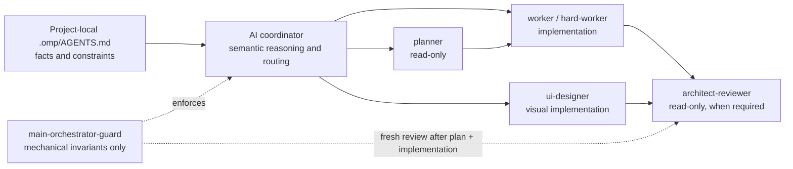

# OMP Adaptive Workflow

> A portable, version-controlled Oh My Pi workflow that separates project knowledge, AI-led routing, specialist execution, and mechanical enforcement.

Most agent setups either hard-code a workflow or leave every decision to an unstructured conversation. OMP Adaptive Workflow keeps the useful middle: a semantic coordinator chooses the smallest capable lane from live evidence, focused agents do the work, and a tiny guard protects only orchestration invariants.

It is a reusable developer tool—not a dotfile dump. It ships no credentials, accounts, sessions, databases, logs, caches, or local-project knowledge.

## The four layers



| Layer | Owns | Explicitly does not own |
| --- | --- | --- |
| Project knowledge | Architecture facts, ownership, sensitive boundaries, verification constraints | Routing instructions |
| AI coordinator | Understanding intent and dynamically selecting a lane | Source-code edits |
| Specialist agents | Planning, implementation, visual work, focused review | Unrelated work |
| Mechanical guard | Coordinator tool restriction and plan/review lifecycle | Semantic risk classification |

The distinction matters. A local profile can say *why* an area is sensitive; it must not say “if X, use planner.” The coordinator uses current request, repository evidence, ambiguity, reversibility, blast radius, contracts, security/privacy, data integrity, coupling, prior failures, and local knowledge to make that judgment. There are no keyword, domain, framework, project-name, or language routing rules in the guard.

## What is included

| Role | Default model role | Responsibility |
| --- | --- | --- |
| Coordinator | `default` — Claude Sonnet 4.6 | Semantic request interpretation and dynamic routing |
| Planner | `plan` — GPT-5.6 Sol High | Read-only plans and root-cause diagnosis |
| Worker | `task` — Gemini 3.8 Flash | Clear, minimal implementation and proportional verification |
| Hard worker | `task` — Gemini 3.8 Flash High thinking | Difficult repair after a meaningful failure |
| UI designer | `designer` — Claude Sonnet 4.6 High thinking | Visual implementation and rendered verification |
| Architect reviewer | `review` — GPT-5.6 Sol Medium | Diff-first material engineering review |

The model names are examples, not a dependency on any account. Workflow behavior is separate from model selection: edit the portable profile to fit your providers and subscriptions while retaining the same operating model.

## Prerequisites

- Oh My Pi installed and initialized for the user who will run it.
- Provider authentication completed in that user's normal OMP installation.
- Git for cloning/updating this repository.
- Bash on Linux/WSL, or PowerShell 7+ (Windows PowerShell also works) on Windows.

Installers never copy, inspect, alter, or back up authentication, OAuth data, API keys, sessions, caches, or provider stores. Authenticate with OMP separately before or after installation.

## Quick start

Clone this repository wherever you keep developer tools, then run the installer from its root.

### Linux

```bash
git clone <your-repository-url> omp-adaptive-workflow
cd omp-adaptive-workflow
./scripts/install.sh
./scripts/verify.sh
```

### Windows PowerShell

```powershell
git clone <your-repository-url> omp-adaptive-workflow
Set-Location omp-adaptive-workflow
Set-ExecutionPolicy -Scope Process Bypass
.\scripts\install.ps1
.\scripts\verify.ps1
```

### WSL

Use the Linux commands in the WSL distribution. The workflow installs into that distribution’s `~/.omp/agent`, which is distinct from a native Windows OMP installation.

```bash
cd omp-adaptive-workflow
./scripts/install.sh
./scripts/verify.sh
```

By default the installers target `~/.omp/agent` (Linux/WSL) or the equivalent `$HOME\.omp\agent` (Windows). To install into a supported alternate OMP location, set `OMP_AGENT_DIR` before running a script.

## Installation behavior

The installer replaces only managed workflow files:

- `AGENTS.md` and `RULES.md`
- the five custom agent definitions
- `extensions/main-orchestrator-guard/index.ts`
- `omp-adaptive-workflow/model-profile.example.yml`

Before a replacement it saves that specific file into a timestamped directory below `<agent-dir>/backups/omp-adaptive-workflow-YYYYMMDD-HHMMSS`. It leaves all other OMP files alone, including `config.yml`, credentials, session history, databases, caches, logs, and extensions not owned by this repository. Re-running the installer is safe and produces a fresh backup only for files it replaces.

### Why the model profile is not auto-merged

YAML has no safe dependency-free “merge unknown configuration” primitive. An installer that guesses at a user's `config.yml` can silently duplicate mappings or damage unrelated settings. Instead, installation copies [config/model-profile.example.yml](config/model-profile.example.yml) alongside the OMP agent directory and prints its location. Review its `modelRoles` and `retry` blocks, then apply only supported values to your own `config.yml` deliberately.

This profile sets one coordinator fallback:

```yaml
default:
  - google-antigravity/gemini-3.8-flash:high
```

Every other role has an explicit empty fallback list. That isolation prevents planner/reviewer work from silently downgrading to the coordinator fallback. Credential rotation remains OMP/provider responsibility.

## How the workflow operates

For routine, clear, reversible work the coordinator sends a short execution contract to `worker`. For work where deeper reasoning materially changes correctness, it asks `planner` first, then hands its plan to an implementation agent. A planner-led implementation must receive a fresh `architect-reviewer` pass before completion. If another implementation occurs after review, that review is stale.

The normal failure ladder is:

```text
worker → meaningful failure → hard-worker
hard-worker / contradictory evidence → planner in diagnosis mode → fresh hard-worker
still blocked → report evidence or ask one critical question
```

Provider, quota, and infrastructure failures are not semantic failures. If a required reviewer cannot run, the coordinator must report review as **NOT COMPLETED**, state why, avoid blind retries, and never call it a pass. Similarly, a successful reviewer task invocation is not enough: it must inspect relevant evidence and return explicit `PASS` or concrete findings.

### Verification and quota discipline

Each implementation specialist owns the smallest useful verification for its work. The coordinator does not habitually spawn a separate verifier or run broad suites. Commands are discovered from the target repository; no agent invents a build/test command. An unavailable environment yields a precise `NOT RUN`/`NOT VERIFIED` report rather than a guessed success.

This conserves both execution and reasoning quota. Planner and reviewer are tools for materially better correctness, not rituals for every diff.

## Project-local knowledge profiles

Copy [examples/project-knowledge/AGENTS.example.md](examples/project-knowledge/AGENTS.example.md) into the project you are working on as `.omp/AGENTS.md`, then fill it with current facts: system identity, architecture, ownership, module responsibilities, integration contracts, sensitive boundaries, supported versions, verification environment, and working-tree constraints.

Do not put credentials in it. Do not turn it into a routing table. It is evidence for the coordinator, not a replacement for semantic judgment.

## Verify an installation

The read-only verification scripts check installed files, all five agents, guard domain-agnosticism, implementation verification ownership, cross-turn plan continuity, reviewer availability policy, guard explanation, and visibility of the recommended isolated fallback profile.

```bash
./scripts/verify.sh
```

```powershell
.\scripts\verify.ps1
```

They end with a `PASS / WARN / FAIL` summary and do not read or print credentials. A missing standalone model profile is a warning because `config.yml` is intentionally not parsed or modified.

## Optional Ponytail / Caveman setup

If you use the optional OMP plugin, install it separately:

```bash
omp plugin install omp-ponytail-caveman
/ponytail install-skills
```

Recommended state: **Ponytail Full** to discourage overengineering and speculative work, and **Caveman Lite** to keep handoffs compact without stripping useful engineering context. Its absence never blocks this workflow.

## Update, restore, and remove

To update a checkout and reinstall:

```bash
git pull
./scripts/install.sh
```

On Windows, run `git pull` then `.\scripts\install.ps1`. For manual rollback, copy a desired file from the timestamped backup directory under the target agent directory back to its original relative location. To remove the workflow, delete only the managed files listed in “Installation behavior” (and the copied `omp-adaptive-workflow` profile directory); this does not affect authentication or unrelated OMP state.

## Share it safely

Share the Git repository, not a populated `~/.omp` directory. Each developer installs it into their own OMP environment, authenticates their own providers, chooses their own model mapping, and keeps project knowledge within each project. The included `.gitignore` rejects common secrets and runtime state; still run the audit below before publishing.

## Screenshots and images

The README works without screenshots. Add real images—not fabricated UI captures—under `docs/images/` using these names if useful:

- `docs/images/omp-startup-model.png`
- `docs/images/omp-agents-screen.png`
- `docs/images/agent-hub-flow.png`
- `docs/images/fallback-profile.png`
- `docs/images/verify-output.png`

Reference them with relative paths, for example ``. The directory contains a `.gitkeep` so it is present in a fresh clone.

## Repository structure

```text
omp-adaptive-workflow/
├── global/                 # coordinator contract and engineering rules
├── agents/                 # planner, workers, UI specialist, reviewer
├── extensions/             # intentionally mechanical guard
├── config/                 # provider-independent model profile
├── examples/               # project knowledge profile template
├── scripts/                # Linux/WSL and PowerShell install + verify scripts
└── docs/images/            # optional real README screenshots
```

## Non-goals and limitations

- It does not provision OMP, providers, subscriptions, or authentication.
- It intentionally does not auto-edit unknown `config.yml` structures.
- It cannot verify model availability or quota; that belongs to OMP and your providers.
- The guard cannot decide what work is risky—that is intentionally delegated to the coordinator.
- The PowerShell scripts are statically portable here; run them on Windows to validate against the target OMP install.

The outcome is a small, auditable workflow distribution that can move between machines without exporting personal OMP state.
